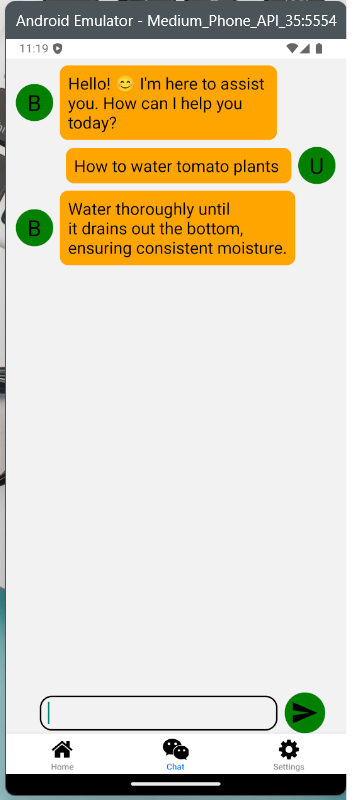

<h1 align="center">Smart Pot : An intelligent Plant Care Assistant </h1>

<div align="center">

[](https://www.microsoft.com/ "Go to Microsoft homepage")
<a href="https://www.linux.org/" title="Go to Linux homepage"></a>


<a href="https://python.org" title="Go to Python homepage"></a>
<a href="https://nodejs.org" title="Go to Node.js homepage"></a>


</div>


Smart Pot is an intelligent plant care assistant that uses AI and IoT to help users monitor and interact with their tomato plants. The system combines a YOLOv5-based detection model, ESP32 with environmental sensors, and a mobile app with a built-in chatbot interface.

## 📚 Table of Contents

- [🚀 Features](#-features)
- [🧠 Tech Stack](#-tech-stack)
- [📱 Screenshots](#-screenshots)
- [🛠️ Installation](#️-installation)
  - [💬 FastAPI Server (Chatbot)](#-fastapi-server-chatbot)
  - [🔧 ESP32 (Sensor Upload)](#-esp32-sensor-upload)
  - [🍓 Raspberry Pi (YOLOv5 Deployment)](#-raspberry-pi-yolov5-deployment)
  - [📲 Mobile App (React Native)](#-mobile-app-react-native)
- [📊 Project Architecture](#-project-architecture)
- [✅ Testing](#-testing)
  - [LLM Chatbot](#llm-chatbot)
  - [YOLOv5 Model](#yolov5-model)
  - [Watering System](#watering-system)
- [📁 Folder Structure](#-folder-structure)
- [📈 Future Improvements](#-future-improvements)
- [👨‍💻 Authors](#-authors)
- [📜 License](#-license)

## 🚀 Features

- 🔍 **Plant Detection**: Identifies the plant using a YOLOv5 object detection model.
- 🌡️ **Sensor Monitoring**: Collects real-time light and moisture levels using an ESP32 microcontroller and uploads data to Firebase.
- 🤖 **Chatbot Interface**: A natural language chatbot (LLM-based) to interact with the plant and provide care suggestions.
- 📱 **React Native App**: Mobile front-end for users to view sensor data and chat with the Smart Pot.

---

## 🧠 Tech Stack

<table border="1">
  <tr>
    <th>Component</th>
    <th>Technology Used</th>
  </tr>
  <tr>
    <td>Object Detection</td>
    <td>YOLOv5 (PyTorch)</td>
  </tr>
  <tr>
    <td>Microcontroller</td>
    <td>ESP32 with Light & Moisture Sensors</td>
  </tr>
  <tr>
    <td>Cloud Database</td>
    <td>Firebase Realtime Database</td>
  </tr>
  <tr>
    <td>Backend Server</td>
    <td>Python (Fast API)</td>
  </tr>
  <tr>
    <td>Chatbot Model</td>
    <td>LLM via Distilled Bert Model</td>
  </tr>
  <tr>
    <td>Mobile App</td>
    <td>React Native (Expo)</td>
  </tr>
</table>

---

## 📱 Screenshots
<div align="center" >
  



</div>

## 🛠️ Installation
>⚠️ **Warning**: This project has been tested with Python 3.11. Functionality with other Python versions is not guaranteed — your mileage may vary.

>💡 **Recommendation**: It is strongly recommended to create a [Python virtual environment](https://docs.python.org/3/library/venv.html) before installing dependencies to avoid version conflicts and maintain a clean setup.

### 💬 FastAPI Server (Chatbot)
The chatbot backend uses FastAPI to serve an LLM-based model. You can either train the model yourself or download a pre-trained version.

#### 🧠 Option 1: Train the Model Yourself
1. Navigate to the `chat-bot-server` directory:
```
cd chat-bot-server
```
2. Install the required dependencies:
```
pip install -r requirements.txt
```
3. Run the training script to generate your own LLM model:
```
python train_llm.py
```
>⏱️ **Note**: Training may take a while depending on your hardware.

#### 📦 Option 2: Download Pre-trained Model
1. Navigate to the `chat-bot-server` directory:
```
cd chat-bot-server
```
2. Install the required dependencies:
```
pip install -r requirements.txt
```
3. Run the download script to fetch a pre-trained model:
```
python download.py
```
#### 🚀 Run the FastAPI Server
Once the model is ready (trained or downloaded), start the FastAPI server:
```
uvicorn main:app --host 0.0.0.0 --reload
```
The API will be available at `http://localhost:8000`.

### 🔧 ESP32 (Sensor Upload)

1. Install the Arduino IDE  
   Download it from [https://www.arduino.cc/en/software](https://www.arduino.cc/en/software).

2. Install Required Libraries  
   Open the Arduino IDE and install the following libraries through the Library Manager:

-  OneWire
-  Dallas Temperature
-  Adafruit Unified Sensor
-  DHT sensor library
-  WiFi (built-in for ESP32)
-  Firebase ESP Client

>💡 Tip: You can use the Library Manager in Arduino IDE (Sketch > Include Library > Manage Libraries) to find and install them easily.

#### 🔌 Flashing the ESP32
1. Connect your ESP32 board via USB.

2. Open the appropriate .ino file from the esp32/ directory.

3. Select your board and port from Tools > Board and Tools > Port.

4. Click Upload to flash the code to the board.

Once uploaded, the ESP32 will begin reading sensor values and uploading them to your Firebase Realtime Database.


### 🍓 Raspberry Pi (YOLOv5 Deployment)
This module runs a modified YOLOv5 model on the Raspberry Pi to detect tomato ripeness and upload the results to Firebase.
#### 🎓 Model Training (Google Colab)
If you haven’t trained your own model yet, use the following [Google Colab notebook](https://colab.research.google.com/drive/1QQZTsLaV2Zb5Jfy4YGsvTl3xIW4toOw9?usp=sharing).

#### 🚀 Deployment on Raspberry Pi
1. Install Raspberry Pi OS
Follow the official installation guide here:<br>
👉 https://www.raspberrypi.com/software/

2. Copy Files to the Pi <br>
Transfer the following files to the home directory (/home/pi/) of your Raspberry Pi:

- best.pt (the trained YOLOv5 model)

- detect.py (your customized inference script)

You can use scp, USB, or any file transfer method.

3. Modified detect.py <br>
This version of detect.py is adapted from the original YOLOv5 repository. It processes each frame, performs detection, and sends results to Firebase in real time.

#### 🧪 Running the Detection Script
Once setup is complete, you can run the detection script with:
```
python3 detect.py
```
Make sure your Raspberry Pi is connected to the internet, and the script will begin analyzing video frames and updating Firebase with detection results.


>💡 **Tip**: After the initial setup, you can run detect.py remotely via SSH without needing a connected display.

### 📲 Mobile App (React Native)
This is the front-end of the Smart Pot system. It connects with Firebase for sensor data, a FastAPI server for the chatbot, and displays real-time plant information.

#### 🧰 Prerequisites
- Node.js (LTS version recommended)
- Expo CLI

#### 📦 Setup Instructions
1. Navigate to the app directory:
```
cd SmartPot
```
2. Install dependencies:
```
npm install
```
3. Start the Expo development server:
```
npx expo start
```
#### ⚙️ Environment Configuration
Make sure your backend URLs (Firebase & FastAPI server) are correctly set in the config file (usually .env or a constants file). Update IP addresses if you’re running the backend locally on a different machine

## 📊 Project Architecture


## ✅ Testing
### LLM ChatBot
<table border="1">
  <tr>
    <th>Test Case</th>
    <th>Input</th>
    <th>Expected Output</th>
    <th>Status</th>
  </tr>
  <tr>
    <td>Query plant name</td>
    <td>"What's my plant?"</td>
    <td>"Tomato"</td>
    <td>✅</td>
  </tr>
  <tr>
    <td>Ask moisture</td>
    <td>"Is my plant thirsty?"</td>
    <td>"Yes, soil is dry"</td>
    <td>✅</td>
  </tr>
</table>

### Yolov5 Model
<table border="1">
  <tr>
    <th>Test Image</th>
    <th>Result</th>
    <th>Confidence</th>
    <th>Status</th>
  </tr>
  <tr>
    <td>Early Blight</td>
    <td>Detected</td>
    <td>0.88</td>
    <td>✅</td>
  </tr>
  <tr>
    <td>Healthy</td>
    <td>Detected</td>
    <td>0.94</td>
    <td>✅</td>
  </tr>
  <tr>
    <td>Late Blight</td>
    <td>Detected</td>
    <td>0.90</td>
    <td>✅</td>
  </tr>
  <tr>
    <td>Leaf Miner</td>
    <td>Detected</td>
    <td>0.85</td>
    <td>✅</td>
  </tr>
  <tr>
    <td>Leaf Mold</td>
    <td>Detected</td>
    <td>0.87</td>
    <td>✅</td>
  </tr>
  <tr>
    <td>Mosaic Virus</td>
    <td>Detected</td>
    <td>0.91</td>
    <td>✅</td>
  </tr>
  <tr>
    <td>Septoria</td>
    <td>Detected</td>
    <td>0.89</td>
    <td>✅</td>
  </tr>
  <tr>
    <td>Spider Mites</td>
    <td>Detected</td>
    <td>0.86</td>
    <td>✅</td>
  </tr>
  <tr>
    <td>Yellow Leaf Curl Virus</td>
    <td>Detected</td>
    <td>0.93</td>
    <td>✅</td>
  </tr>
  <tr>
    <td>Other Plant</td>
    <td>Not Detected</td>
    <td>-</td>
    <td>✅</td>
  </tr>
</table>

### Watering System

<table border="1">
  <tr>
    <th>Condition</th>
    <th>Moisture (%)</th>
    <th>Action Taken</th>
    <th>Status</th>
  </tr>
  <tr>
    <td>Sufficient Water</td>
    <td>&gt; 30%</td>
    <td>No action</td>
    <td>✅</td>
  </tr>
  <tr>
    <td>Low Moisture</td>
    <td>&le; 30%</td>
    <td>Pump activated</td>
    <td>✅</td>
  </tr>
</table>

## 📁 Folder Structure


## 📈 Future Improvements

- 🌿 **Fertilizer Recommendations**
Analyze plant growth stages and environmental data to suggest personalized fertilization schedules, improving yield and plant health.

- 🧪 **Nutrient Deficiency Detection**
Use computer vision to detect visual signs of nutrient stress (e.g., yellowing leaves) and alert users with corrective suggestions.

- 🌐 **Multi-Plant Support**
Allow users to manage and monitor multiple smart pots within the same app, each with unique sensor profiles and chat histories.

- 📤 **Data Export and Reports**
Enable users to generate monthly care logs, watering history, and sensor trends in downloadable PDF/CSV formats.

- 🔐 **User Profiles & Authentication**
Implement secure login and personalized dashboards, supporting multiple users per pot (e.g., families or research teams).

## 👨‍💻 Authors
- **Binoy C E** – App Developer
- **Alvis Sajith** - Backend Developer
- **AJ Kashyapnath** - AI/ML Developer
- **Ayush Baiju** - IOT Setup

## 📜 License
This project is licensed under the MIT License. You are free to use, modify, and distribute it with attribution. :)
